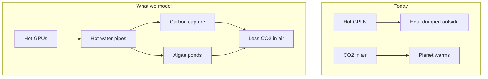
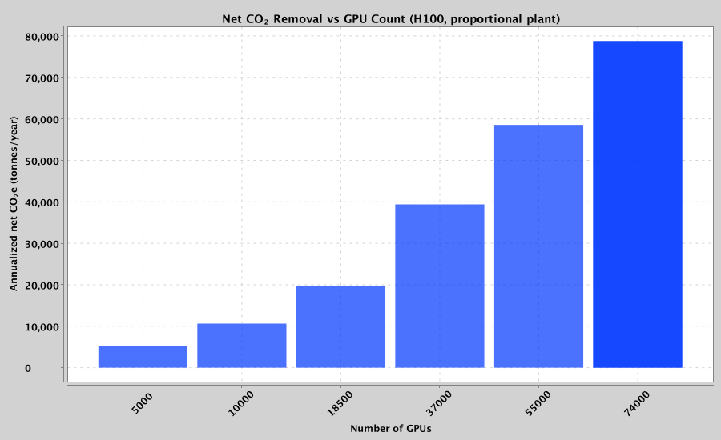
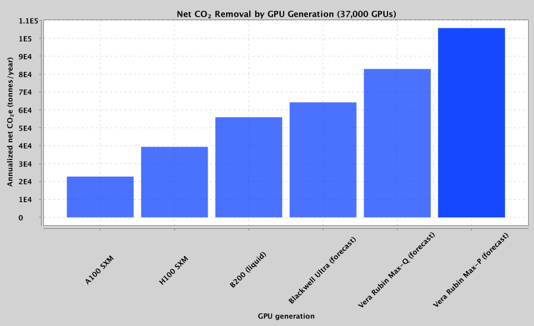
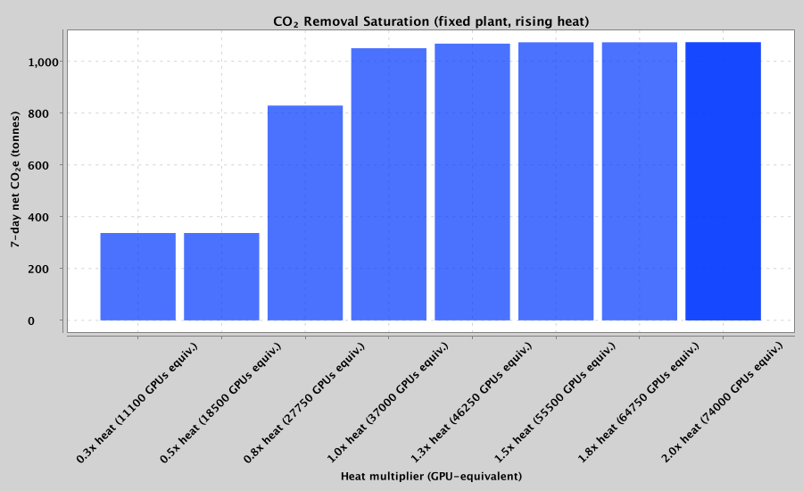
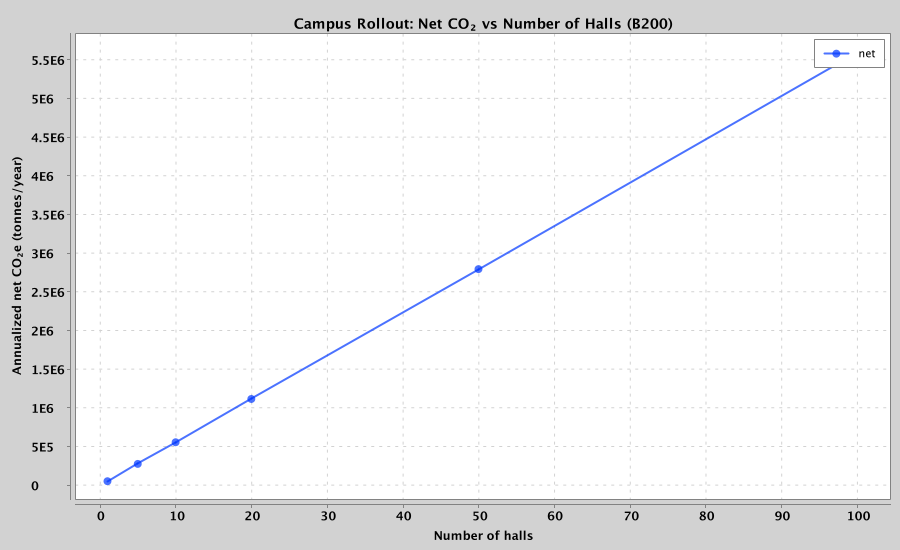
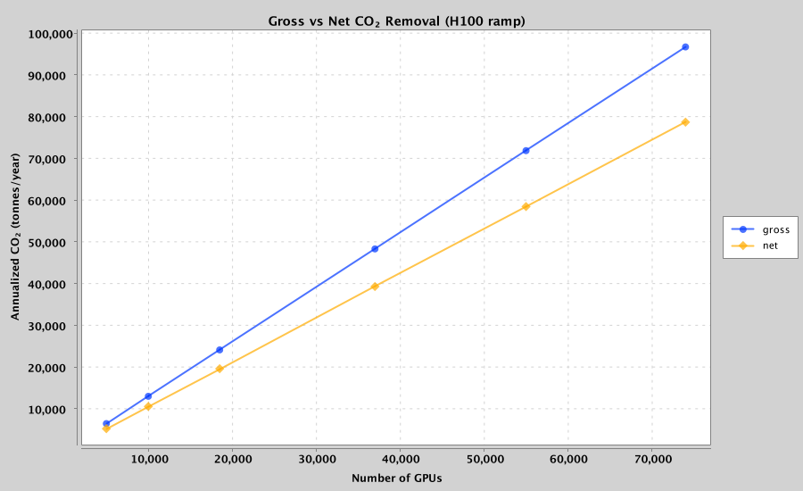
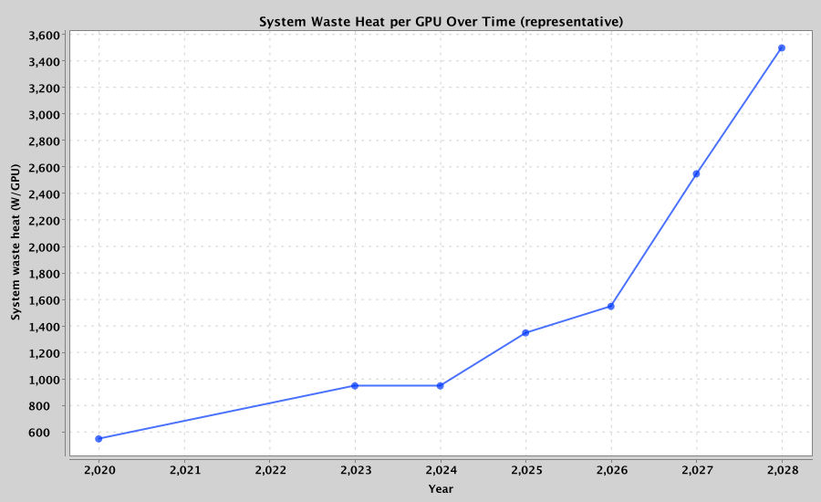

<p align="center">
  <strong>Data Center Heater Side Gig</strong><br>
  <em>Job 1: cool the GPUs. Side gig: pull CO₂ from the air.</em>
</p>

<p align="center">
  <a href="#start-here">Start here</a> ·
  <a href="#the-big-idea">Big idea</a> ·
  <a href="#what-we-found-nvidia-us">NVIDIA results</a> ·
  <a href="#scalability-charts">Scalability</a> ·
  <a href="#how-the-simulation-works">Methods</a> ·
  <a href="#try-it-yourself">Run it</a> ·
  <a href="#glossary">Glossary</a>
</p>

<p align="center">
  
  
  
  
  
</p>

---

## Start here

> **In one sentence:** Data centers are giant heaters. What if that heat had a **side gig** — removing CO₂ from the atmosphere instead of only warming the planet?

Companies like **NVIDIA** are building huge **data centers** full of powerful **GPUs** (the chips that train AI). Those chips get **hot**. Cooling them produces **waste heat** — the data center’s unwanted “heater” output. Today, most of that heat is thrown away.

**Data Center Heater Side Gig** is a **computer simulation** of a smarter second job for that heat:

1. Capture the hot water cooling the GPUs.
2. Use that heat to run **carbon capture** machines and **algae ponds**.
3. Measure how much CO₂ is removed — and whether it actually helps the climate after you pay for electricity.

You do **not** need to be an engineer to understand the results. Read [The big idea](#the-big-idea) first, then [What we found](#what-we-found-nvidia-us).

---

## The big idea

### The problem (explained simply)

| What happens today | Why it matters |
|--------------------|----------------|
| GPUs crunch numbers for AI | They use a lot of electricity |
| Almost all that electricity becomes **heat** | Heat has to go somewhere |
| Data centers **cool** the chips with water or air | Then dump the heat outside |
| That heat is **waste** | It does not help anyone |

At the same time, Earth has **too much CO₂** in the atmosphere from burning fossil fuels. CO₂ acts like a blanket and traps heat — that is the main driver of **global warming**.

### The idea we simulate



**Carbon capture (DAC)** — Special materials suck CO₂ out of the air. They need **heat** to “release” and store that CO₂. GPU waste heat can help power that process (often through a **heat pump** that warms the heat up even more).

**Algae ponds** — Tiny plants in water use sunlight to grow. As they grow, they pull CO₂ from the air (same idea as trees, but faster in the right conditions). They grow best at a **steady, warm temperature** — which waste heat can help maintain.

A **robotic controller** in our simulation decides *where* to send the heat: carbon capture, algae, storage, or emergency cooling — similar to how a smart thermostat picks where warmth should go.

---

## What we found (NVIDIA U.S.)

We ran the simulator for **one liquid-cooled U.S. AI hall** (~50 MW waste heat, DAC priority, 30 days). The headline result is on the order of **~56,000 tonnes/year net CO₂ removed** — meaningful for one building, tiny vs global emissions.

**Full scalability analysis** — GPU counts, generation comparisons, campus rollout, and charts — is in [Scalability: GPUs, heat, and CO₂](#scalability-charts) below. Those numbers are **auto-generated** when you run `./gradlew generateFigures`.

For a balanced DAC + algae rotation (one pipe at a time), see [balanced run](#balanced-dac--algae) in [Try it yourself](#try-it-yourself).

---

## GPU reference (representative NVIDIA profiles)

| GPU | Era | System heat per chip | Plain English |
|-----|-----|----------------------|---------------|
| A100 SXM | deployed | ~550 W | ~6 bright light bulbs per chip |
| H100 SXM | deployed | ~950 W | ~10 light bulbs — today's DC standard |
| B200 (liquid) | ramping | ~1,350 W | ~14 light bulbs — matches our reference hall |
| Blackwell Ultra | forecast | ~1,550 W | hotter next-gen Blackwell |
| Vera Rubin Max-P | forecast | ~2,550 W | ~25 light bulbs — liquid-only forecast |

**How we count GPUs in a hall:** `GPUs ≈ building waste heat ÷ heat per GPU` → 50 MW ÷ 1.35 kW ≈ **37,000 B200s**.

Forecast rows use **public GTC / analyst targets**, not NVIDIA engineering data. See [`config/gpu_profiles.yaml`](config/gpu_profiles.yaml).

---

<a id="scalability-charts"></a>

<!-- SCALABILITY:BEGIN — auto-generated by ./gradlew generateFigures; do not edit -->
## Scalability: GPUs, heat, and CO₂

*This section was auto-generated by `./gradlew generateFigures` (template fallback).*

### The takeaway

- **More GPUs make more waste heat** — like more engines running in a parking lot.
- **More heat can remove more CO₂** if capture equipment scales with the GPUs (bigger bucket).
- **Newer chips run hotter per GPU**, so the same building with next-gen silicon can do more climate work.

### How many GPUs are we talking about?

Our reference hall uses **37,000 B200 (liquid) GPUs** at about **50 MW** average waste heat (heat per GPU × GPU count).

### More GPUs (H100)



**Analogy:** More students → more leftover hot food → more composting

**Lesson:** Line rises when plant grows with GPU count.

**Sim highlight:** 37000 GPUs → **39,382 tonnes/year** net CO₂e.

### Same 37,000 GPUs, different generations



**Analogy:** Same stoves, stronger burners each upgrade

**Lesson:** Newer GPUs push more heat per chip.

**Sim highlight:** Blackwell Ultra → **64,255 tonnes/year** net CO₂e.

### Fixed plant, more heat



**Analogy:** Fire hose into a fixed bucket

**Lesson:** Curve flattens when capture equipment is maxed out.

**Sim highlight:** 1.3x heat (46250 GPUs equiv.) → **55,697 tonnes/year** net CO₂e.

### Campus rollout



**Analogy:** Copy one successful compost program to many schools

**Lesson:** More halls ≈ more total CO₂ removed.

**Sim highlight:** 20 halls → **1,119,287 tonnes/year** net CO₂e.

### Gross vs net CO₂



**Analogy:** Gross = cookies baked; net = cookies minus eggs you bought.

At **74,000 GPUs**: gross **96,786** vs net **78,765 tonnes/year**.

### GPU heat timeline



Phone-charger analogy: each generation runs **hotter on purpose** for AI speed. Forecast points use public roadmap targets, not secret NVIDIA data.

### Results table

| Story | GPUs | Chip | Halls | Net CO₂e/year | So what? |
|-------|------|------|-------|---------------|----------|
| Lab cluster | 5,000 | H100 SXM | 1 | 5,322 | ~1,157 cars off the road |
| One AI hall (H100 scale) | 37,000 | H100 SXM | 1 | 39,382 | ~8,561 cars off the road |
| 10-hall campus | 37,000 | B200 (liquid) | 10 | 559,644 | ~121,662 cars off the road |
| Rubin forecast | 17,000 | Rubin Ultra (rack equiv.) | 1 | 66,664 | ~14,492 cars off the road |

### Four stories

**The lab (5k GPUs)** — 5,000 H100 SXM GPUs, 1 hall(s), **5,322 tonnes/year** net. Limitation: one heat pipe at a time in this MVP.

**The hall (37k GPUs)** — 37,000 Blackwell Ultra GPUs, 1 hall(s), **64,255 tonnes/year** net. Limitation: one heat pipe at a time in this MVP.

**The campus (10 halls)** — 37,000 B200 (liquid) GPUs, 10 hall(s), **559,644 tonnes/year** net. Limitation: one heat pipe at a time in this MVP.

### Common questions (FAQ)

**Does more AI automatically help the climate?** No — only if waste heat powers capture, not the sky.

**Why does electricity matter?** Heat pumps need grid power, which still emits CO₂.

**Why zero algae sometimes?** Our MVP routes heat to one load at a time; DAC often wins.

**Is this a full climate fix?** No — meaningful for one campus, tiny vs global emissions.

**Are Rubin numbers real?** Forecast from public roadmaps, not NVIDIA internal data.

### Generated at: 2026-06-05T08:58:46.712043Z

### Forecast disclaimer

Forecast GPU profiles (B300, Rubin) use **public GTC and analyst targets**. They illustrate direction, not guaranteed specs.
<!-- SCALABILITY:END -->

---

## How the simulation works

This section is the **method** — how we turned a real-world question into numbers. Written so a motivated high-school student can follow it.

### Step 1 — Build a virtual power plant

We coded a **digital twin** in Java: a simplified copy of pipes, pumps, tanks, and controllers. Every **60 seconds** of simulated time, the computer updates temperatures, flows, and CO₂ totals.


### Step 2 — Physics (the science rules)

We use honest-but-simplified engineering math:

| Rule | What it means | Analogy |
|------|---------------|---------|
| **Heat moves from hot to cold** | GPU loop → heat exchanger → storage tank | Pouring hot tea into a cold mug |
| **Q = ṁ × c × ΔT** | Flow rate × heat capacity × temperature change = power | How much “thermal energy” water carries |
| **Heat exchanger** | Transfers heat without mixing fluids | Two zippered pockets touching — heat crosses, liquids do not |
| **Reject path** | Emergency radiator to ambient | Opening a window when too hot |
| **Safety first** | GPUs must never overheat | Simulation always protects chips before optimizing CO₂ |

### Step 3 — Carbon capture model

1. Hot water from the data center enters a **secondary loop**.
2. A **heat pump** (like an AC unit in reverse) boosts that heat to ~**90 °C**.
3. Hot sorbent material **releases** captured CO₂ for storage.
4. CO₂ captured per second ≈ **heat delivered ÷ energy needed per kg CO₂** (~5.5 MJ/kg in our defaults).

If source water is **below 40 °C**, the heat pump **stalls** — like trying to bake cookies in an oven that never preheated.

### Step 4 — Algae model

Algae growth depends on three knobs we multiply together:

```
growth = surface area × daylight × temperature comfort × CO₂ bonus from DAC
```

| Factor | Intuition |
|--------|-----------|
| **Daylight** | No sun at night → no photosynthesis |
| **Temperature** | Best around **28 °C**; too cold or too hot slows growth |
| **DAC CO₂ bonus** | Bubbling captured CO₂ into ponds can speed growth |

Waste heat **does not replace sunlight**. It **keeps the water warm** so daytime growth stays efficient.

### Step 5 — Climate scorecard

We report:

| Metric | Formula (simplified) |
|--------|----------------------|
| **Gross removal** | DAC kg + algae kg |
| **Electricity penalty** | heat-pump kWh × U.S. grid CO₂ factor (0.39 kg/kWh) |
| **Net CO₂e removed** | gross − penalty |
| **Annualized tonnes** | scale 30-day or 1-year run to 365 days |

> **Important:** “Warming offset in milli-Kelvin” in the output is a **teaching toy**, not a NASA climate model. Trust **net tonnes CO₂e** for the real story.

### Step 6 — What we assume (and what we do not)

| We model | We do not model (yet) |
|----------|----------------------|
| Heat flow, pumps, valves | Real NVIDIA facility blueprints |
| DAC + algae + routing | Storing CO₂ underground |
| 30-day / annualized scaling | Full 365-day weather file per city |
| U.S. average grid emissions | Hour-by-hour grid greenness |
| One load connected at a time | Parallel pipes to all systems |

Assumptions are documented in [`config/nvidia_us_expansion.yaml`](config/nvidia_us_expansion.yaml).

---

## Try it yourself

### Prerequisites

- **Java 20+**
- Terminal access

### Quick demo (1 hour of simulated time)

```bash
./gradlew test
./gradlew run --args="--fast"
```

### NVIDIA U.S. expansion (30 simulated days)

```bash
./gradlew run --args="--config config/nvidia_us_expansion.yaml --scenario nvidia_us_module"
```

### Balanced DAC + algae {#balanced-dac--algae}

Rotation between algae and carbon capture (one pipe at a time in this MVP):

```bash
./gradlew run --args="--config config/nvidia_us_algae.yaml --scenario nvidia_us_module"
```

### Regenerate scalability charts and README results

Runs 7-day sweeps, writes PNGs to `docs/figures/`, updates `docs/results_summary.json`, and patches the [scalability section](#scalability-charts) (LLM if `OPENAI_API_KEY` is set, otherwise template fallback):

```bash
export OPENAI_API_KEY=sk-...   # optional — enables LLM-written explanations
./gradlew generateFigures
```

### What to look for in the output

```
--- CO2 Removal ---
DAC CO2 captured:     ...
Algae CO2 fixed:      ...
Net CO2e removed:     ...

--- Climate Impact (illustrative) ---
Annualized net removal: ... tonnes CO2e/yr
```

---

## Project map

```
datacenter-heater-sidegig/
├── README.md                          ← you are here
├── config/
│   ├── default.yaml                   demo / classroom scale
│   ├── nvidia_us_expansion.yaml       50 MW U.S. hall (DAC priority)
│   ├── nvidia_us_algae.yaml           50 MW hall (rotation)
│   ├── gpu_profiles.yaml              NVIDIA SKU thermal profiles
│   └── scalability_sweep.yaml         sweep parameters for figures
├── docs/
│   ├── figures/                       scalability PNGs (generateFigures)
│   └── results_summary.json           machine-readable sweep output
└── src/main/java/com/heater/
    ├── App.java                       CLI
    ├── analysis/                      sweeps, charts, README explainer
    ├── thermal/                       heat exchangers, simulator
    ├── carbon/                        DAC, algae, climate math
    ├── control/                       safety + automation
    └── robot/                         load routing
```

---

## Glossary

| Term | Simple definition |
|------|-------------------|
| **GPU** | Graphics Processing Unit — a chip that does parallel math; used heavily for AI |
| **Data center** | A building full of computers |
| **Waste heat** | Unwanted thermal energy left over after electricity does work |
| **CO₂ / CO₂e** | Carbon dioxide (and “equivalent” gases) — greenhouse gases |
| **DAC** | Direct Air Capture — technology that filters CO₂ from ambient air |
| **Heat pump** | Device that moves heat uphill from cool to hot (uses electricity) |
| **Algae bioreactor** | Controlled pond or tank growing algae for CO₂ uptake |
| **Megawatt (MW)** | One million watts — a measure of power |
| **Tonne** | 1,000 kg — used for CO₂ mass (1 tonne ≈ 2,204 lbs) |
| **Simulation** | A computer experiment that mimics reality with math |
| **Net removal** | CO₂ pulled out minus CO₂ emitted to run equipment |

---

## For teachers and reviewers

### Learning goals

Students engaging with this repo can practice:

- Connecting **energy**, **heat transfer**, and **climate** in one story
- Reading **quantitative results** with appropriate skepticism
- Understanding **tradeoffs** (electricity penalty vs. thermal benefit)
- Seeing how **engineering models** simplify reality on purpose

### Suggested discussion questions

1. Why does the heat pump’s electricity use **reduce** net climate benefit?
2. Why is algae growth **zero at night** in the model?
3. If NVIDIA builds **twice** as many GPUs, does CO₂ removal **double** forever? Why not?
4. What would you add to make this simulation more fair or more realistic?

### Technical stack

| Layer | Choice |
|-------|--------|
| Language | Java 20+ (primitive `double` hot loop, records for snapshots) |
| Build | Gradle 8.7 |
| Config | YAML (SnakeYAML) |
| Tests | JUnit 5 |
| Charts | XChart (`./gradlew generateFigures`) |

### Mapping simulation → real hardware

| In code | In the real world |
|---------|-------------------|
| `ccsValveOpen` | Valve to the carbon capture plant |
| `algaeValveOpen` | Valve to algae pond heaters |
| `RoboticRouter` | Automated pipe manifold or robot coupler |
| `q_waste` | Live data from GPU power and coolant sensors |

---

## Honest limitations

1. **Not official NVIDIA data** — inspired by public hyperscale scales, not internal engineering.
2. **One pipe at a time** — real sites would run multiple loops in parallel.
3. **Climate “mK offset”** — illustrative only.
4. **Algae economics** — we count CO₂ in biomass, not fuel sales or food products.
5. **Safety** — real plants need physical fail-safes beyond software.

---

## License & contribution

This is an educational simulation project. Run tests before changing physics or safety code:

```bash
./gradlew test
```

---

<p align="center">
  <strong>Every data center is a heater.</strong><br>
  This project gives that heat a side gig.
</p>

<p align="center">
  <sub>Data Center Heater Side Gig · simulation only — not engineering advice for live data centers.</sub>
</p>
