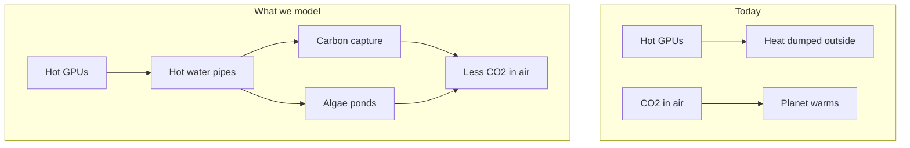

<p align="center">
  <strong>Data Center Heater Side Gig</strong><br>
  <em>Job 1: cool the GPUs. Side gig: pull CO₂ from the air.</em>
</p>

<p align="center">
  <a href="#start-here">Start here</a> ·
  <a href="#the-big-idea">Big idea</a> ·
  <a href="#what-we-found-nvidia-us">NVIDIA results</a> ·
  <a href="#scalability-charts">Scalability</a> ·
  <a href="#how-the-simulation-works">Methods</a> ·
  <a href="#try-it-yourself">Run it</a> ·
  <a href="#glossary">Glossary</a>
</p>

<p align="center">
  
  
  
  
  
</p>

---

## Start here

> **In one sentence:** Data centers are giant heaters. What if that heat had a **side gig** — removing CO₂ from the atmosphere instead of only warming the planet?

Companies like **NVIDIA** are building huge **data centers** full of powerful **GPUs** (the chips that train AI). Those chips get **hot**. Cooling them produces **waste heat** — the data center’s unwanted “heater” output. Today, most of that heat is thrown away.

**Data Center Heater Side Gig** is a **computer simulation** of a smarter second job for that heat:

1. Capture the hot water cooling the GPUs.
2. Use that heat to run **carbon capture** machines and **algae ponds**.
3. Measure how much CO₂ is removed — and whether it actually helps the climate after you pay for electricity.

Read [The big idea](#the-big-idea) first, then [What we found](#what-we-found-nvidia-us).

---

## The big idea

### The problem (explained simply)

| What happens today | Why it matters |
|--------------------|----------------|
| GPUs crunch numbers for AI | They use a lot of electricity |
| Almost all that electricity becomes **heat** | Heat has to go somewhere |
| Data centers **cool** the chips with water or air | Then dump the heat outside |
| That heat is **waste** | It does not help anyone |

At the same time, Earth has **too much CO₂** in the atmosphere from burning fossil fuels. CO₂ acts like a blanket and traps heat — that is the main driver of **global warming**.

### The idea we simulate



**Carbon capture (DAC)** — Special materials suck CO₂ out of the air. They need **heat** to “release” and store that CO₂. GPU waste heat can help power that process (often through a **heat pump** that warms the heat up even more).

**Algae ponds** — Tiny plants in water use sunlight to grow. As they grow, they pull CO₂ from the air (same idea as trees, but faster in the right conditions). They grow best at a **steady, warm temperature** — which waste heat can help maintain.

A **robotic controller** in our simulation decides *where* to send the heat: carbon capture, algae, storage, or emergency cooling — similar to how a smart thermostat picks where warmth should go.

---

## What we found (NVIDIA U.S.)

We ran the simulator for **one liquid-cooled U.S. AI hall** (~**25,000 GPUs**, ~34 MW waste heat on B200 liquid, DAC priority). Full numbers are in [Scalability](#scalability-charts) — expressed as **cars off the road**, not abstract tonnes.

**Full scalability analysis** — GPU counts, generation comparisons, campus rollout, and charts — is in [Scalability: GPUs, heat, and CO₂](#scalability-charts) below. Those numbers are **auto-generated** when you run `./gradlew generateFigures`.

For a balanced DAC + algae rotation (one pipe at a time), see [balanced run](#balanced-dac--algae) in [Try it yourself](#try-it-yourself).

---

## GPU reference (representative NVIDIA profiles)

| GPU | Era | System heat per chip | Plain English |
|-----|-----|----------------------|---------------|
| A100 SXM | deployed | ~550 W | ~6 bright light bulbs per chip |
| H100 SXM | deployed | ~950 W | ~10 light bulbs — today's DC standard |
| B200 (liquid) | ramping | ~1,350 W | ~14 light bulbs — our reference hall chip |
| Blackwell Ultra | forecast | ~1,550 W | hotter next-gen Blackwell |
| Vera Rubin Max-P | forecast | ~2,550 W | ~25 light bulbs — liquid-only forecast |

**Reference hall:** **25,000 B200 (liquid) GPUs** ≈ **34 MW** waste heat (`25,000 × 1.35 kW`).

### Hall size sources (why 25k, not 37k)

| Source | What it says |
|--------|----------------|
| [ServeTheHome xAI Colossus tour](https://www.servethehome.com/inside-100000-nvidia-gpu-xai-colossus-cluster-supermicro-helped-build-for-elon-musk/) | **Four ~25,000-GPU compute halls** in the 100k H100 cluster |
| [Introl B200 deployment guide](https://introl.com/blog/nvidia-b200-vs-gb200-deployment-guide) | ~**160–224 GPUs per MW** for B200 HGX (8-GPU racks) |
| [SemiAnalysis GB200 architecture](https://semianalysis.substack.com/p/gb200-hardware-architecture-and-component) | NVL72 rack: **72 GPUs @ ~120 kW** (~1.7 kW/GPU rack power) |

An earlier draft used ~37,000 GPUs (~50 MW). That was internally consistent but **above documented single-hall sizes**. We recalibrated to **25,000 GPUs** to match real U.S. hyperscale halls.

Forecast rows use **public GTC / analyst targets**, not NVIDIA engineering data. See [`config/gpu_profiles.yaml`](config/gpu_profiles.yaml).

### CO₂ analogies (how we translate tonnes)

| Unit | Value | Source |
|------|-------|--------|
| 1 U.S. car / year | **4.6 tonnes CO₂** | U.S. EPA average passenger vehicle |
| 1 U.S. home / year | **~8.5 tonnes CO₂** | EIA / EPA home energy |
| NYC–London flight | **~1 tonne CO₂** | ICAO calculator |

Charts and auto-generated results use **cars off the road** as the primary axis. See [`config/impact_analogies.yaml`](config/impact_analogies.yaml).

---

<a id="scalability-charts"></a>

<!-- SCALABILITY:BEGIN — auto-generated by ./gradlew generateFigures; do not edit -->
## Scalability: GPUs, heat, and CO₂

*Auto-generated by `./gradlew generateFigures`. Charts use **cars off the road** instead of tonnes — see [impact analogies](config/impact_analogies.yaml).*

### The takeaway

- **More GPUs → more waste heat** — like more cars idling in a parking garage, all exhausting heat.
- **More heat can pull more CO₂ from the air** — but only if capture equipment grows with the hall (bigger bucket).
- **Newer NVIDIA chips run hotter each generation**, so the same hall with Blackwell or Rubin can do more climate work.

### How many GPUs are we talking about?

Our **reference hall** has **25,000 B200 (liquid) GPUs** and about **34 MW** of average waste heat (heat per chip × chip count).

**Is that realistic?** Yes for a serious U.S. AI buildout. xAI's Colossus cluster in Memphis uses **four ~25,000-GPU compute halls** (100,000 H100s total) per the [ServeTheHome / Supermicro tour](https://www.servethehome.com/inside-100000-nvidia-gpu-xai-colossus-cluster-supermicro-helped-build-for-elon-musk/). We model **one such hall**, not an entire campus.

**Older note:** An earlier draft used ~37,000 GPUs (~50 MW). That was thermodynamically consistent but **larger than documented single-hall deployments**. We recalibrated to **25,000 GPUs** (~34 MW on B200 liquid).

### Chart 1 — More GPUs (H100-class hall)


*Y-axis: cars off the road (1 car ≈ 4.6 tonnes CO₂/year, U.S. EPA)*

**Analogy:** More lunch trays → more leftover hot food → more composting.

**Lesson:** When the capture plant scales with the GPUs, removal grows steadily.

**Example from this sim:** 25000 GPUs → That's **~5,779 cars off U.S. roads for one year** — the same climate benefit as if those cars' tailpipes emitted nothing (≈ 4.6 tonnes CO₂ per car, EPA average). Scientifically that is **26,583 tonnes of CO₂ pulled from the air annually**. Also comparable to **~3,127 homes'** yearly energy emissions, **~26,583 NYC–London round-trip flights**, or **~302.7 million miles** of driving avoided.

### Chart 2 — Same hall, newer chips


*Y-axis: cars off the road (1 car ≈ 4.6 tonnes CO₂/year, U.S. EPA)*

**Analogy:** Same kitchen, but each stove upgraded to a stronger burner.

**Lesson:** Hotter chips push more waste heat through the same number of GPUs.

**Example from this sim:** Blackwell Ultra → That's **~9,429 cars off U.S. roads for one year** — the same climate benefit as if those cars' tailpipes emitted nothing (≈ 4.6 tonnes CO₂ per car, EPA average). Scientifically that is **43,372 tonnes of CO₂ pulled from the air annually**. Also comparable to **~5,103 homes'** yearly energy emissions, **~43,372 NYC–London round-trip flights**, or **~493.8 million miles** of driving avoided.

### Chart 3 — Fixed capture plant, more heat


*Y-axis: cars off the road (1 car ≈ 4.6 tonnes CO₂/year, U.S. EPA)*

**Analogy:** A fire hose filling a bucket that never gets bigger — water spills over.

**Lesson:** Past ~1× reference heat, the curve flattens: equipment is maxed out.

**Example from this sim:** 1.3x heat (31250 GPUs equiv.) → That's **~8,173 cars off U.S. roads for one year** — the same climate benefit as if those cars' tailpipes emitted nothing (≈ 4.6 tonnes CO₂ per car, EPA average). Scientifically that is **37,597 tonnes of CO₂ pulled from the air annually**. Also comparable to **~4,423 homes'** yearly energy emissions, **~37,597 NYC–London round-trip flights**, or **~428.1 million miles** of driving avoided.

### Chart 4 — Campus rollout (many halls)


*Y-axis: cars off the road (1 car ≈ 4.6 tonnes CO₂/year, U.S. EPA)*

**Analogy:** One school compost program copied to 10, then 100 schools.

**Lesson:** Each ~25k-GPU hall adds another chunk of cars-off-road impact.

**Example from this sim:** 20 halls → That's **~164,243 cars off U.S. roads for one year** — the same climate benefit as if those cars' tailpipes emitted nothing (≈ 4.6 tonnes CO₂ per car, EPA average). Scientifically that is **755,519 tonnes of CO₂ pulled from the air annually**. Also comparable to **~88,885 homes'** yearly energy emissions, **~755,519 NYC–London round-trip flights**, or **~8602.3 million miles** of driving avoided.

### Chart 5 — Gross vs. net (the electricity penalty)


*Y-axis: cars off the road (1 car ≈ 4.6 tonnes CO₂/year, U.S. EPA) — two lines: before and after heat-pump electricity.*

**Analogy:** Gross = cookies baked; net = cookies minus the eggs you had to buy at the store.

At **50,000 GPUs**: gross **~14,202 cars** vs net **~11,558 cars** per year. The gap is the CO₂ cost of running heat pumps.

### Chart 6 — GPU heat rises each generation


**Y-axis:** 100 W light bulbs running nonstop per GPU (easier than watts alone).

Each generation runs **hotter on purpose** for AI speed. Forecast points (†) use public roadmap targets.

### What does removing CO₂ actually mean?

A **tonne** is a metric ton (1,000 kg) — accurate for scientists but meaningless to most people. Below we translate every headline number into **cars off U.S. roads for one year** (≈ 4.6 tonnes CO₂ per car, EPA average).

### Results — in cars, not just tonnes

| Story | GPUs | Chip | Halls | Cars off the road / year | What that means |
|-------|------|------|-------|--------------------------|-----------------|
| Startup lab | 5,000 | H100 SXM | 1 | ~1,156 cars | Like ~1,156 cars parked for a year, or ~625 homes' energy use |
| One Colossus-style hall (H100) | 25,000 | H100 SXM | 1 | ~5,779 cars | Like ~5,779 cars parked for a year, or ~3,127 homes' energy use |
| One hall (B200 liquid) | 25,000 | B200 (liquid) | 1 | ~8,212 cars | Like ~8,212 cars parked for a year, or ~4,444 homes' energy use |
| 10-hall campus | 25,000 | B200 (liquid) | 10 | ~82,122 cars | Like ~82,122 cars parked for a year, or ~44,442 homes' energy use |
| Rubin forecast hall | 13,200 | Vera Rubin Max-P | 1 | ~8,190 cars | Like ~8,190 cars parked for a year, or ~4,432 homes' energy use |

### Four stories

**The lab (~5,000 GPUs)** — That's **~1,156 cars off U.S. roads for one year** — the same climate benefit as if those cars' tailpipes emitted nothing (≈ 4.6 tonnes CO₂ per car, EPA average). Scientifically that is **5,317 tonnes of CO₂ pulled from the air annually**. Also comparable to **~625 homes'** yearly energy emissions, **~5,317 NYC–London round-trip flights**, or **~60.5 million miles** of driving avoided. Limitation: our MVP routes heat to one load at a time.

**The hall (~25,000 GPUs)** — That's **~8,212 cars off U.S. roads for one year** — the same climate benefit as if those cars' tailpipes emitted nothing (≈ 4.6 tonnes CO₂ per car, EPA average). Scientifically that is **37,776 tonnes of CO₂ pulled from the air annually**. Also comparable to **~4,444 homes'** yearly energy emissions, **~37,776 NYC–London round-trip flights**, or **~430.1 million miles** of driving avoided. Limitation: our MVP routes heat to one load at a time.

**The campus (10 halls)** — That's **~82,122 cars off U.S. roads for one year** — the same climate benefit as if those cars' tailpipes emitted nothing (≈ 4.6 tonnes CO₂ per car, EPA average). Scientifically that is **377,760 tonnes of CO₂ pulled from the air annually**. Also comparable to **~44,442 homes'** yearly energy emissions, **~377,760 NYC–London round-trip flights**, or **~4301.2 million miles** of driving avoided. Limitation: our MVP routes heat to one load at a time.

### Common questions (FAQ)

**Does more AI automatically help the climate?** No. Heat must power capture — not just vent to the sky.

**Why show cars instead of tonnes?** People grasp "cars off the road"; tonnes are abstract.

**Are 25,000 GPUs in one hall real?** Yes — xAI Colossus documents ~25k per compute hall. A full campus is 4× that or more.

**Why does electricity matter?** Heat pumps use grid power, which still emits CO₂ — that shrinks the net benefit.

**Is this a full climate fix?** No. Even 100 halls is tiny vs ~36 billion tonnes global emissions/year.

### Generated at: 2026-06-05T09:10:05.329596Z

### Sources & disclaimers

- **Hall size:** ServeTheHome / Supermicro xAI Colossus tour (~25k GPUs/hall).
- **Car analogy:** U.S. EPA ~4.6 tonnes CO₂/year per average passenger vehicle.
- **GPU heat:** NVIDIA datasheets + SemiAnalysis NVL72 rack power (~120 kW / 72 GPUs).
- **Forecast chips (B300, Rubin):** Public GTC roadmaps — illustrative, not NVIDIA internal specs.
<!-- SCALABILITY:END -->

---

## How the simulation works

This section is the **method** — how we turned a real-world question into numbers. Written so a motivated high-school student can follow it.

### Step 1 — Build a virtual power plant

We coded a **digital twin** in Java: a simplified copy of pipes, pumps, tanks, and controllers. Every **60 seconds** of simulated time, the computer updates temperatures, flows, and CO₂ totals.


### Step 2 — Physics (the science rules)

We use honest-but-simplified engineering math:

| Rule | What it means | Analogy |
|------|---------------|---------|
| **Heat moves from hot to cold** | GPU loop → heat exchanger → storage tank | Pouring hot tea into a cold mug |
| **Q = ṁ × c × ΔT** | Flow rate × heat capacity × temperature change = power | How much “thermal energy” water carries |
| **Heat exchanger** | Transfers heat without mixing fluids | Two zippered pockets touching — heat crosses, liquids do not |
| **Reject path** | Emergency radiator to ambient | Opening a window when too hot |
| **Safety first** | GPUs must never overheat | Simulation always protects chips before optimizing CO₂ |

### Step 3 — Carbon capture model

1. Hot water from the data center enters a **secondary loop**.
2. A **heat pump** (like an AC unit in reverse) boosts that heat to ~**90 °C**.
3. Hot sorbent material **releases** captured CO₂ for storage.
4. CO₂ captured per second ≈ **heat delivered ÷ energy needed per kg CO₂** (~5.5 MJ/kg in our defaults).

If source water is **below 40 °C**, the heat pump **stalls** — like trying to bake cookies in an oven that never preheated.

### Step 4 — Algae model

Algae growth depends on three knobs we multiply together:

```
growth = surface area × daylight × temperature comfort × CO₂ bonus from DAC
```

| Factor | Intuition |
|--------|-----------|
| **Daylight** | No sun at night → no photosynthesis |
| **Temperature** | Best around **28 °C**; too cold or too hot slows growth |
| **DAC CO₂ bonus** | Bubbling captured CO₂ into ponds can speed growth |

Waste heat **does not replace sunlight**. It **keeps the water warm** so daytime growth stays efficient.

### Step 5 — Climate scorecard

We report:

| Metric | Formula (simplified) |
|--------|----------------------|
| **Gross removal** | DAC kg + algae kg |
| **Electricity penalty** | heat-pump kWh × U.S. grid CO₂ factor (0.39 kg/kWh) |
| **Net CO₂e removed** | gross − penalty |
| **Annualized tonnes** | scale 30-day or 1-year run to 365 days |

> **Important:** “Warming offset in milli-Kelvin” in the output is a **teaching toy**, not a NASA climate model. Trust **net tonnes CO₂e** for the real story.

### Step 6 — What we assume (and what we do not)

| We model | We do not model (yet) |
|----------|----------------------|
| Heat flow, pumps, valves | Real NVIDIA facility blueprints |
| DAC + algae + routing | Storing CO₂ underground |
| 30-day / annualized scaling | Full 365-day weather file per city |
| U.S. average grid emissions | Hour-by-hour grid greenness |
| One load connected at a time | Parallel pipes to all systems |

Assumptions are documented in [`config/nvidia_us_expansion.yaml`](config/nvidia_us_expansion.yaml).

---

## Try it yourself

### Prerequisites

- **Java 20+**
- Terminal access

### Quick demo (1 hour of simulated time)

```bash
./gradlew test
./gradlew run --args="--fast"
```

### NVIDIA U.S. expansion (30 simulated days)

```bash
./gradlew run --args="--config config/nvidia_us_expansion.yaml --scenario nvidia_us_module"
```

### Balanced DAC + algae {#balanced-dac--algae}

Rotation between algae and carbon capture (one pipe at a time in this MVP):

```bash
./gradlew run --args="--config config/nvidia_us_algae.yaml --scenario nvidia_us_module"
```

### Regenerate scalability charts and README results

Runs 7-day sweeps, writes PNGs to `docs/figures/`, updates `docs/results_summary.json`, and patches the [scalability section](#scalability-charts) (LLM if `OPENAI_API_KEY` is set, otherwise template fallback):

```bash
export OPENAI_API_KEY=sk-...   # optional — enables LLM-written explanations
./gradlew generateFigures
```

### What to look for in the output

```
--- CO2 Removal ---
DAC CO2 captured:     ...
Algae CO2 fixed:      ...
Net CO2e removed:     ...

--- Climate Impact (illustrative) ---
Annualized net removal: ... tonnes CO2e/yr
```

---

## Project map

```
datacenter-heater-sidegig/
├── README.md                          ← you are here
├── config/
│   ├── default.yaml                   demo / classroom scale
│   ├── nvidia_us_expansion.yaml       50 MW U.S. hall (DAC priority)
│   ├── nvidia_us_algae.yaml           50 MW hall (rotation)
│   ├── gpu_profiles.yaml              NVIDIA SKU thermal profiles
│   └── scalability_sweep.yaml         sweep parameters for figures
├── docs/
│   ├── figures/                       scalability PNGs (generateFigures)
│   └── results_summary.json           machine-readable sweep output
└── src/main/java/com/heater/
    ├── App.java                       CLI
    ├── analysis/                      sweeps, charts, README explainer
    ├── thermal/                       heat exchangers, simulator
    ├── carbon/                        DAC, algae, climate math
    ├── control/                       safety + automation
    └── robot/                         load routing
```

---

## Glossary

| Term | Simple definition |
|------|-------------------|
| **GPU** | Graphics Processing Unit — a chip that does parallel math; used heavily for AI |
| **Data center** | A building full of computers |
| **Waste heat** | Unwanted thermal energy left over after electricity does work |
| **CO₂ / CO₂e** | Carbon dioxide (and “equivalent” gases) — greenhouse gases |
| **DAC** | Direct Air Capture — technology that filters CO₂ from ambient air |
| **Heat pump** | Device that moves heat uphill from cool to hot (uses electricity) |
| **Algae bioreactor** | Controlled pond or tank growing algae for CO₂ uptake |
| **Megawatt (MW)** | One million watts — a measure of power |
| **Tonne** | 1,000 kg — used for CO₂ mass (1 tonne ≈ 2,204 lbs) |
| **Simulation** | A computer experiment that mimics reality with math |
| **Net removal** | CO₂ pulled out minus CO₂ emitted to run equipment |

---

## For teachers and reviewers

### Learning goals

Students engaging with this repo can practice:

- Connecting **energy**, **heat transfer**, and **climate** in one story
- Reading **quantitative results** with appropriate skepticism
- Understanding **tradeoffs** (electricity penalty vs. thermal benefit)
- Seeing how **engineering models** simplify reality on purpose

### Suggested discussion questions

1. Why does the heat pump’s electricity use **reduce** net climate benefit?
2. Why is algae growth **zero at night** in the model?
3. If NVIDIA builds **twice** as many GPUs, does CO₂ removal **double** forever? Why not?
4. What would you add to make this simulation more fair or more realistic?

### Technical stack

| Layer | Choice |
|-------|--------|
| Language | Java 20+ (primitive `double` hot loop, records for snapshots) |
| Build | Gradle 8.7 |
| Config | YAML (SnakeYAML) |
| Tests | JUnit 5 |
| Charts | XChart (`./gradlew generateFigures`) |

### Mapping simulation → real hardware

| In code | In the real world |
|---------|-------------------|
| `ccsValveOpen` | Valve to the carbon capture plant |
| `algaeValveOpen` | Valve to algae pond heaters |
| `RoboticRouter` | Automated pipe manifold or robot coupler |
| `q_waste` | Live data from GPU power and coolant sensors |

---

## Honest limitations

1. **Not official NVIDIA data** — inspired by public hyperscale scales, not internal engineering.
2. **One pipe at a time** — real sites would run multiple loops in parallel.
3. **Climate “mK offset”** — illustrative only.
4. **Algae economics** — we count CO₂ in biomass, not fuel sales or food products.
5. **Safety** — real plants need physical fail-safes beyond software.

---

## License & contribution

This is an educational simulation project. Run tests before changing physics or safety code:

```bash
./gradlew test
```

---

<p align="center">
  <strong>Every data center is a heater.</strong><br>
  This project gives that heat a side gig.
</p>

<p align="center">
  <sub>Data Center Heater Side Gig · simulation only — not engineering advice for live data centers.</sub>
</p>
